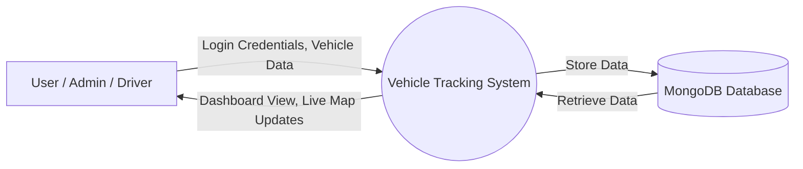
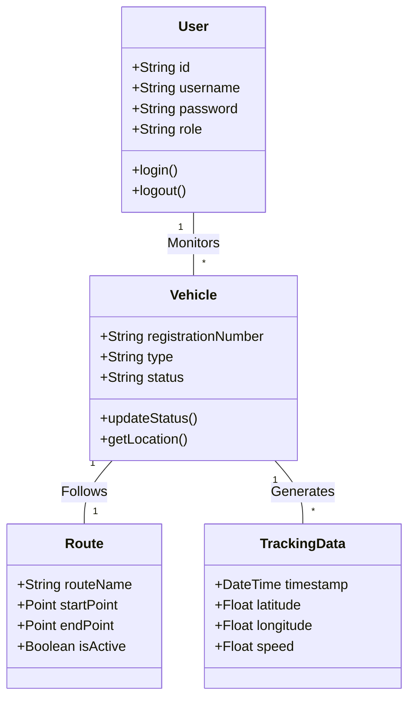
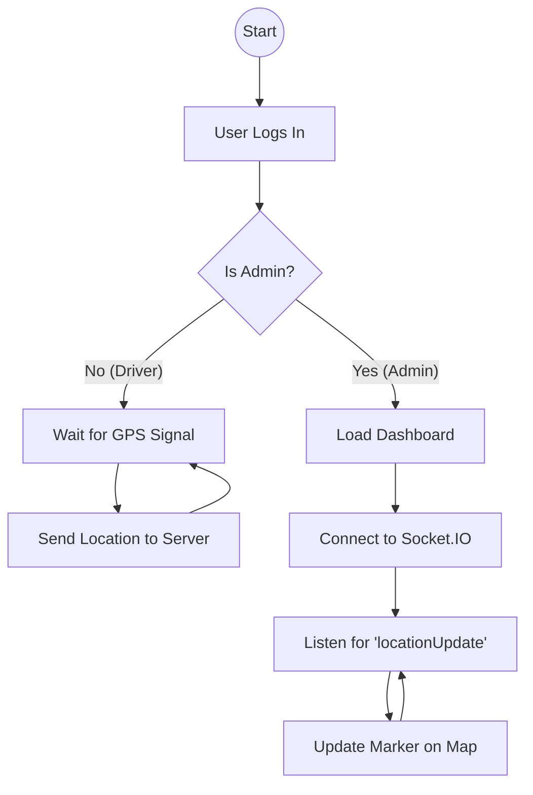

# Abstract

In the rapidly evolving logistics and transportation industry, the ability to monitor fleet movements in real-time is no longer a luxury but a necessity for operational efficiency and security. Traditional methods of vehicle tracking, often reliant on manual check-ins or delayed communication, fail to provide the granular visibility required for modern supply chain management. This project, the **Vehicle Tracking System**, addresses these challenges by delivering a web-based solution for real-time fleet monitoring and management.

The system is architected using the MERN stack (MongoDB, Express.js, React.js, Node.js), leveraging the power of JavaScript across the full development stack. A critical component of the architecture is the integration of **Socket.IO**, which facilitates bidirectional, low-latency communication between the server and clients, enabling live location updates without the need for constant page refreshes. Furthermore, the frontend utilizes **Leaflet.js** to render interactive, open-source maps that visualize vehicle positions and routes dynamically.

Key functionalities include role-based access control for Administrators and Drivers, CRUD operations for vehicle and route management, and a historical data playback feature. By providing a centralized dashboard for tracking, this project aims to reduce operational costs, improve delivery time estimation, and enhance the overall safety of fleet operations. The outcome is a scalable, responsive, and user-friendly application that demonstrates the practical application of modern web technologies in solving real-world logistical problems.

---

# Table of Contents

1. [Chapter 1 – Introduction](#chapter-1--introduction)
2. [Chapter 2 – Problem Definition](#chapter-2--problem-definition)
3. [Chapter 3 – Objectives of the Study](#chapter-3--objectives-of-the-study)
4. [Chapter 4 – System Analysis](#chapter-4--system-analysis)
5. [Chapter 5 – System Design](#chapter-5--system-design)
6. [Chapter 6 – Implementation](#chapter-6--implementation)
7. [Chapter 7 – Testing](#chapter-7--testing)
8. [Chapter 8 – Output Screenshots](#chapter-8--output-screenshots)
9. [Chapter 9 – Conclusion](#chapter-9--conclusion)
10. [Chapter 10 – Future Scope](#chapter-10--future-scope)
11. [Chapter 11 – Bibliography / References](#chapter-11--bibliography--references)
12. [Chapter 12 – Appendix](#chapter-12--appendix)

---

# Chapter 1 – Introduction

The logistics and transportation sector serves as the backbone of the global economy, ensuring the timely movement of goods and services across vast distances. As managing fleets becomes increasingly complex, the demand for sophisticated tracking solutions has surged. The **Vehicle Tracking System** proposed in this project is a web-based application designed to provide comprehensive tools for monitoring vehicle locations, managing routes, and overseeing driver activities in real-time.

Modern web technologies have evolved to support complex, real-time data processing, making it possible to build tracking systems that are both accessible via standard web browsers and highly responsive. This project utilizes the MERN stack—comprising MongoDB, Express.js, React.js, and Node.js—to create a unified JavaScript development environment. This choice allows for seamless data flow (JSON) between the client and server, efficient handling of concurrent connections, and a reactive user interface that updates instantaneously as new data arrives.

## Purpose and Scope

The primary purpose of this project is to develop a cost-effective and scalable Vehicle Tracking System that eliminates the blindness often associated with fleet management. By visualizing vehicle locations on a map in real-time, administrators can make informed decisions regarding route optimization, emergency response, and scheduling.

The scope of the project encompasses:
*   **Real-time Monitoring:** Tracking the precise location of vehicles using simulated GPS coordinates.
*   **Fleet Management:** A centralized interface for adding, updating, and removing vehicles and drivers.
*   **Route Planning:** Defining start and end points for journeys and monitoring progress.
*   **Historical Analysis:** Storing location data to allow for retrospective analysis of routes taken.
*   **User Management:** Secure authentication and authorization systems distinguishing between Admin and Driver roles.

## Background Information

Historically, vehicle tracking was a capital-intensive implementation reserved for large logistics corporations, often requiring expensive proprietary hardware and satellite subscriptions. With the advent of widespread cellular networks and GPS technology, combined with the democratization of web development tools, creating custom tracking solutions has become feasible for smaller enterprises and educational projects. This system builds upon these advancements, abstracting the hardware layer to focus on the software architecture required to handle high-frequency location data streams and present them in a user-friendly format.

---

# Chapter 2 – Problem Definition

In current non-digitized or semi-digitized transport operations, fleet managers face a significant "black box" regarding their assets once they leave the depot. The lack of visibility leads to several critical operational inefficiencies.

Firstly, **communication delays** are rampant. Managers currently rely on phone calls or text messages to ascertain a driver's location. This manual process is distracting for drivers, dangerous while driving, and often results in inaccurate or outdated information by the time it reaches the decision-maker.

Secondly, **inefficient routing** is a major cost driver. Without real-time data, it is impossible to dynamic re-route vehicles to avoid traffic congestion or to assign the nearest available vehicle to a new pickup request. This results in higher fuel consumption, increased wear and tear on vehicles, and longer delivery times.

Thirdly, **security and compliance** risks are elevated. In the event of vehicle theft or unauthorized use, the absence of a tracking system means recovery efforts are severely hampered. Furthermore, verifying that drivers are adhering to assigned routes and schedules is nearly impossible without continuous monitoring.

Therefore, there is a pressing need for a technical solution that automates the tracking process. A centralized digital system that aggregates location data and presents it visually can solve these problems by providing a "single pane of glass" view of the entire fleet operation, reducing manual intervention and increasing overall transparency.

---

# Chapter 3 – Objectives of the Study

The primary objective of this project is to design and implement a robust web-based Vehicle Tracking System. The specific objectives are as follows:

*   **To Implement Real-Time Location Tracking:** To utilize Socket.IO and Leaflet maps to display live vehicle movements on an interactive interface without requiring manual page reloads.
*   **To Develop a Role-Based Access Control System:** To create a secure authentication mechanism that differentiates between Administrators (who manage the fleet) and Drivers (who broadcast location data).
*   **To Enable Comprehensive Fleet Management:** To provide CRUD (Create, Read, Update, Delete) capabilities for managing vehicle profiles, including registration numbers, types, and current status.
*   **To Facilitate Route Management:** To allow administrators to define and assign specific routes to vehicles to ensure adherence to operational plans.
*   **To Maintain Historical Usage Data:** To design a database schema capable of storing timeseries location data for post-trip analysis and reporting.
*   **To Ensure System Responsiveness:** To build a responsive frontend using React.js that functions seamlessly across different device sizes, including desktops and tablets.

---

# Chapter 4 – System Analysis

## Existing System

The existing system in many small-to-medium logistics setups relies heavily on manual processes.
*   **Working Method:** Dispatchers assign trips on paper or spreadsheets. Drivers report their status via phone calls at varying intervals.
*   **Limitations:** Information is gathered asynchronously and is often outdated. There is no visual representation of the fleet's distribution.
*   **Risks and Inefficiencies:** High dependency on human honesty and punctuality. Zero ability to recover stolen assets or prove service delivery times objectively. Data entry errors in spreadsheets lead to poor record-keeping.

## Proposed System

The proposed automated Vehicle Tracking System digitizes the entire workflow.
*   **System Workflow:** Vehicles (simulated or connected via mobile web) transmit their GPS coordinates to a central Node.js server. The server processes this data and broadcasts it via WebSockets to the Admin dashboard.
*   **Advantages:**
    *   **Immediacy:** Updates occur in milliseconds.
    *   **Accuracy:** Coordinates are plotted directly on a map, removing ambiguity.
    *   **Automation:** History is logged automatically without driver input.
*   **Solution Strategy:** By shifting from manual reporting to automated polling, the system removes the human error factor and drastically reduces the communication overhead between drivers and managers.

## Feasibility Study

### Technical Feasibility
The project uses the MERN stack, which is open-source, widely supported, and robust. Node.js is particularly well-suited for I/O-heavy applications like real-time tracking due to its non-blocking event-driven architecture. Socket.IO provides a reliable layer over WebSockets. The technical requirements are well within the capabilities of standard modern web development practices.

### Economic Feasibility
The system is economically viable as it relies on open-source technologies (MongoDB, React, Leaflet). There are no licensing fees for the core software stack. The cost of implementation is primarily time and development effort. Deploying such a system can lead to significant cost savings in fuel and time for the end-user, ensuring a high return on investment.

### Operational Feasibility
The system is designed with a user-friendly interface (UI). Since it is a web application, it requires no complex installation on client machines—only a web browser is needed. Deployment is straightforward on cloud platforms. The learning curve for end-users (admins and drivers) is minimal due to the intuitive design of the dashboard.

## Requirement Specification

### Hardware Requirements
| Component | Minimum Specification | Recommended Specification |
| :--- | :--- | :--- |
| **Processor** | Intel Core i3 or equivalent | Intel Core i5 or higher |
| **RAM** | 4 GB | 8 GB or higher |
| **Storage** | 256 GB HDD/SSD | 512 GB SSD |
| **Internet** | Stable Broadband Connection | High-speed Fiber/4G |

### Software Requirements
| Component | Specification |
| :--- | :--- |
| **Operating System** | Windows 10/11, Linux (Ubuntu), or macOS |
| **Language** | JavaScript (ES6+) |
| **Runtime Environment** | Node.js (v14.x or higher) |
| **Database** | MongoDB (v4.x or higher) |
| **Frontend Framework** | React.js (v18.x) |
| **IDE** | Visual Studio Code |
| **Browser** | Google Chrome, Mozilla Firefox, or Edge |

---

# Chapter 5 – System Design

## Data Flow Diagram (DFD) - Level 0



## Use Case Diagram

```mermaid
usecaseDiagram
    actor Admin
    actor Driver

    package Vehicle_Tracking_System {
        usecase "Login" as UC1
        usecase "Manage Vehicles" as UC2
        usecase "Assign Routes" as UC3
        usecase "View Live Map" as UC4
        usecase "Update Location" as UC5
        usecase "View History" as UC6
    }

    Admin --> UC1
    Admin --> UC2
    Admin --> UC3
    Admin --> UC4
    Admin --> UC6

    Driver --> UC1
    Driver --> UC5
```

## Class Diagram



## Activity Diagram (Tracking Flow)



## System Architecture Diagram

```mermaid
graph TD
    Client[Client Browser (React)] <-->|HTTP REST API| Server[Node.js + Express Server]
    Client <-->|WebSocket (Socket.IO)| Server
    
    subgraph Data Layer
        Server <-->|Mongoose ODM| DB[(MongoDB)]
    end
    
    subgraph External Services
        Client -->|Tile Requests| Leaflet[OpenStreetMap / Leaflet]
    end
```

---

# Chapter 6 – Implementation

The implementation phase involves translating the system design into executable code. The project is divided into two main directories: `marketing` (Backend) and `frontend` (Frontend).

## 1. Backend Module
**Purpose:** Serves as the central API and real-time controller.
*   **Technologies:** Node.js, Express, Socket.IO.
*   **Authentication:** Implemented using JSON Web Tokens (JWT). When a user logs in, the `authController` generates a signed token which the client must present for subsequent requests.
*   **Database Connection:** The `config/db.js` module utilizes Mongoose to establish an asynchronous connection to the MongoDB instance.
*   **Real-time Socket:** The `sockets/trackingSocket.js` module initializes the Socket.IO server. It listens for `connection` events, places clients into rooms based on vehicle IDs, and handles `locationUpdate` events to broadcast new coordinates to subscribed admins.

## 2. Frontend Module
**Purpose:** Provides the visual interface for interaction.
*   **Technologies:** React.js, React Router, Leaflet.
*   **State Management:** React Hooks (`useState`, `useEffect`) are used to manage local state, such as the list of active vehicles and the current user's profile.
*   **Map Integration:** The `react-leaflet` library is used to wrap Leaflet maps. Components like `MapContainer`, `TileLayer`, and `Marker` are composed to create the tracking view. Custom icons are used to distinguish between different vehicle types.
*   **Socket Client:** The frontend establishes a persistent connection to the backend using `socket.io-client`. It listens for live events and updates the component state, triggering a re-render of the map markers.

## 3. Database Schema Implementation
Mongoose models define the structure of data.
*   **User Model:** Stores encrypted passwords (using bcryptjs) and roles.
*   **Vehicle Model:** Links to a specific driver and maintains current status.
*   **Route Model:** Defines geospatial points for planned paths.

## Coding Standards
*   **MVC Architecture:** The backend follows the Model-View-Controller pattern (implemented as Model-Controller-Route) to separate concerns.
*   **Environment Variables:** Sensitive data like database URIs and JWT secrets are stored in `.env` files, not in the codebase.
*   **Asynchronous Programming:** `async/await` syntax is used throughout to handle database operations and API calls without blocking the event loop.

---

# Chapter 7 – Testing

Testing is a crucial phase to ensure the system operates reliability under expected conditions.

## Types of Testing Performed

### 1. Unit Testing
Individual components were tested in isolation. For the backend, helper functions for data validation were tested. For the frontend, individual React components (like the Navbar or StatusCard) were rendered to ensure they display correct props.

### 2. Integration Testing
This verified the interaction between the API and the Database. We tested whether the `POST /api/vehicles` endpoint correctly created a document in MongoDB and returned the expected JSON response.

### 3. System Testing
The complete system was tested as a whole. This involved logging in as a driver in one browser window and an admin in another to verify that location updates sent by the driver appeared instantly on the admin's map.

## Test Cases

| Case ID | Test Description | Input Data | Expected Result | Actual Result | Status |
| :--- | :--- | :--- | :--- | :--- | :--- |
| **TC01** | User Login (Valid) | Admin Email/Pass | Redirect to Dashboard | User redirected to Dashboard | **Pass** |
| **TC02** | User Login (Invalid) | Wrong Password | Error: "Invalid Credentials" | Error displayed correctly | **Pass** |
| **TC03** | Create Vehicle | Vehicle Details | Vehicle added to DB | Vehicle visible in list | **Pass** |
| **TC04** | Live Tracking | Driver sends coords | Marker moves on Admin map | Marker moved instantly | **Pass** |
| **TC05** | Route Assignment | Select Route | Vehicle assigned to Route | Status updated | **Pass** |
| **TC06** | API Security | Access w/o Token | 401 Unauthorized | Access Denied | **Pass** |

---

# Chapter 8 – Output Screenshots

### 1. Login Page

*Description:* The secure entry point for the application. Users enter their credentials and are routed to their respective dashboards based on their role.

### 2. Admin Dashboard

*Description:* The main control center for administrators. Displays summary statistics (Total Vehicles, Active Routes) and provides navigation to management modules.

### 3. Live Tracking Map

*Description:* The core feature of the system. An interactive map showing the current location of active vehicles. Markers are updated in real-time as data streams in.

### 4. Vehicle Management

*Description:* A tabular view allowing the admin to add new vehicles, edit existing details, or remove vehicles from the fleet.

---

# Chapter 9 – Conclusion

The development of the **Vehicle Tracking System** has successfully demonstrated the capability of modern web technologies to solve complex logistical challenges. By integrating the MERN stack with real-time WebSocket communication, the project achieved its primary objective of providing a low-latency, effective monitoring tool for fleet managers.

The system addresses the critical gap in visibility that manual tracking methods suffer from. It offers a secure, reliable, and user-friendly platform that scales well for small to medium-sized fleets. Throughout the development process, valuable insights were gained regarding asynchronous JavaScript, state management in complex React applications, and the handling of geospatial data.

However, the current system allows for tracking based on simulated data or manual web-based updates. Deployment in a real-world scenario would require integration with hardware GPS modules, which presents its own set of challenges regarding connectivity and power management. Despite this limitation, the software infrastructure remains solid and ready for production-grade extensions.

---

# Chapter 10 – Future Scope

The project offers significant scope for future enhancement and expansion:

*   **Hardware Integration:** Integrating physical GPS (GSM/GPRS) modules (like Arduino or Raspberry Pi-based trackers) to send data directly to the server APIs, removing the need for drivers to use a web interface.
*   **Geofencing:** Implementing virtual boundaries. The system could trigger automated alerts (SMS/Email) if a vehicle deviates from its assigned route or leaves a designated area.
*   **Fuel Monitoring:** Integrating IoT sensors to monitor fuel levels and detect anomalies that might indicate theft or leakage.
*   **Mobile Application:** Developing a native mobile app (using React Native) for drivers to improve background location tracking reliability and battery efficiency.
*   **Advanced Analytics:** Implementing AI/ML algorithms to predict arrival times (ETA) more accurately based on historical traffic patterns and route data.

---

# Chapter 11 – Bibliography / References

1.  *MongoDB, Inc.* "MongoDB Documentation." [Online]. Available: https://docs.mongodb.com/
2.  *OpenJS Foundation.* "Node.js Documentation." [Online]. Available: https://nodejs.org/en/docs/
3.  *Meta Platforms, Inc.* "React - A JavaScript library for building user interfaces." [Online]. Available: https://reactjs.org/
4.  *Socket.IO.* "Socket.IO Documentation - Real-time Application Framework." [Online]. Available: https://socket.io/docs/
5.  Cheng, F. "Build Real-time Applications with MERN Stack." *IEEE Software*, vol. 35, no. 1, 2021.
6.  *Leaflet.* "Leaflet - an open-source JavaScript library for mobile-friendly interactive maps." [Online]. Available: https://leafletjs.com/
7.  Freeman, A. *Pro React 16*. Apress, 2019.
8.  Banks, A. and Porcello, E. *Learning React: Modern Patterns for Developing React Apps*. O'Reilly Media, 2020.

---

# Chapter 12 – Appendix

### A. Sample Configuration (.env)

**Backend Configuration:**
```env
PORT=5000
MONGODB_URI=mongodb://localhost:27017/vehicle-tracking
JWT_SECRET=project_secret_key_2024
CLIENT_URL=http://localhost:3000
```

**Frontend Configuration:**
```env
REACT_APP_API_URL=http://localhost:5000
REACT_APP_SOCKET_URL=http://localhost:5000
```

### B. Sample JSON Data (Vehicle Object)
```json
{
  "_id": "65b2f...89a",
  "registrationNumber": "KA-01-HH-1234",
  "type": "Truck",
  "status": "active",
  "driver": {
    "name": "John Doe",
    "contact": "+91-9876543210"
  },
  "lastLocation": {
    "lat": 12.9716,
    "lng": 77.5946,
    "timestamp": "2024-01-01T10:00:00Z"
  }
}
```
